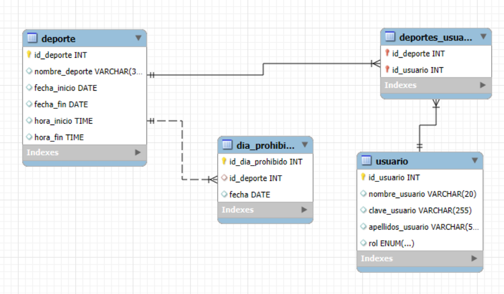
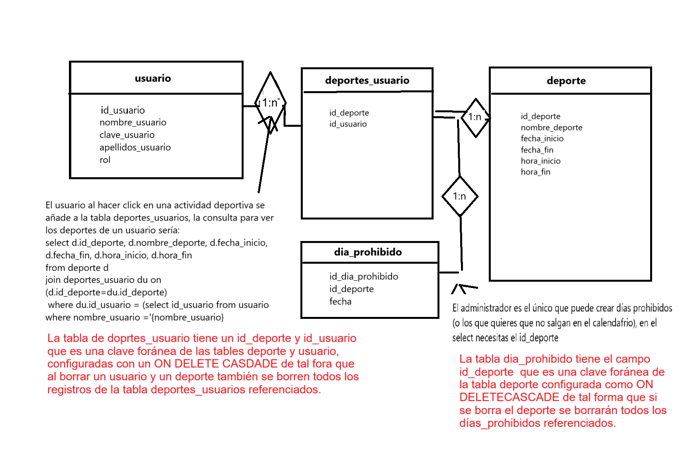
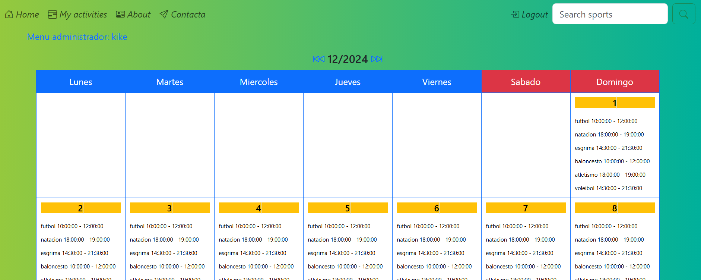
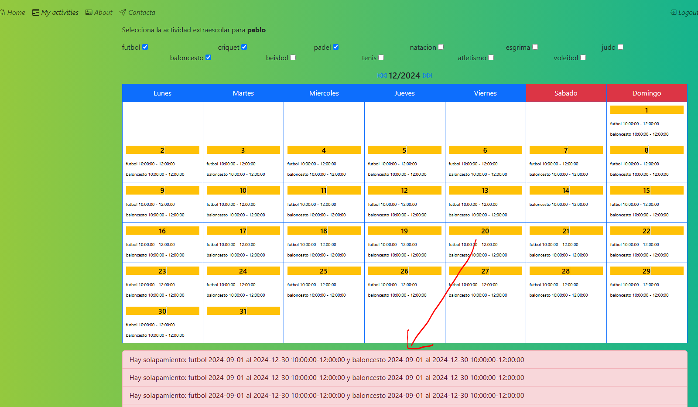
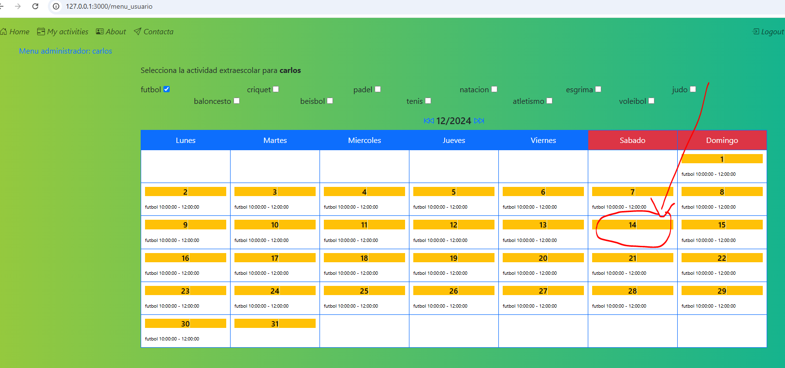
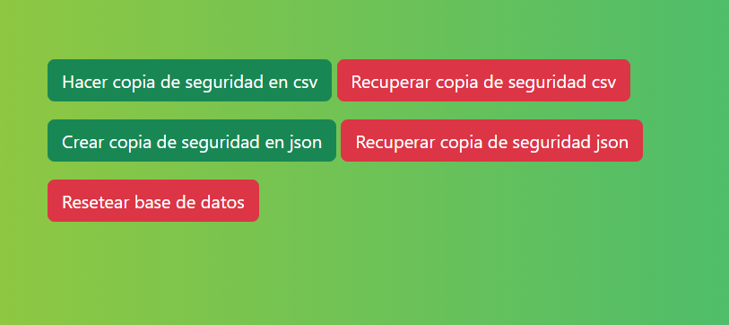
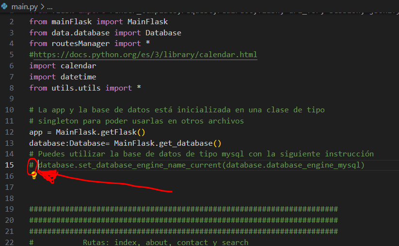
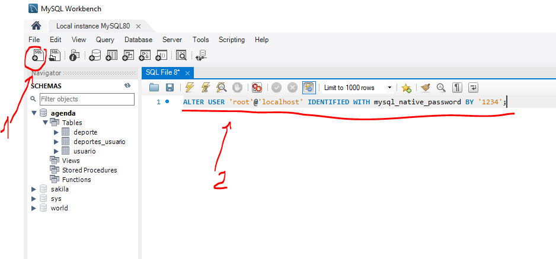

# ¿Que es agenda?

Agenda es el proyecto final del curso de desarrollo visualización de datos con Python, tiene como objetivos:

github: https://github.com/avanzatipolisto/agenda

Puedes probarlos online en render: https://agenda-9vz7.onrender.com

## Integración de Base de Datos: Utilizar una base de datos para almacenar yngestionar datos de forma estructurada.

</img>

</img>

## Visualización Web: Crear una interfaz web donde se puedan visualizar losdatos de manera interactiva. 

Agenda es una herramienta que te permite crear turnos para una actividad en un rango de fechas y horarios.

En la página de inicio se ven todos los turnos de las actividades mezcladas.

</img>

Cuando se loguea y aparece el menú del usuario puede añadirse a sus actividades, si las actividades se superponen se le avisa.

</img>

Cada actividad tiene unos días prohibidos en los que no aparecerá en el calendario.

</img>

Puedes probarlos online en render.com: https://agenda-8s3p.onrender.com

(puede ser que tarde en arrancar)
Su instancia gratuita dejará de funcionar debido a la inactividad, lo que puede retrasar las solicitudes 50 segundos o más.

Hemos trabajado con html, javascript, css (boostrap), flask, sesiones, formularios y validaciones pero no hemos creado ningún objeto propio y en la vista tocamos la lógica la base de datos, <a href="#">en el siguiente proyecto trabajaremos con el Model View Contoller (MVC)</a>.

## Extra: Manipulación de Ficheros: Incluir funcionalidades para leer y escribirficheros de datos (por ejemplo, CSV, JSON, txt) y gestionarlos de manera eficiente. 

Para trabajar con archivos hemos implementado la funcionalidad de crear copias de seguridad:

</img>

# Instrucciones de desarrollo

1. Instala python desde aqui: https://www.python.org/downloads/

2. Crea el entorno virtual con el comando: python -m venv .venv

3. Activa el entorno virtual con el comando: .\venv\Scripts\activate

4. Pone el interprete python del entorno virtual pulsando Ctrl+shift+p y escribien python interpreter, elege el python que tenga (.venv)

5. Dentro del entorno virtual escribe:

    pip install flask

    pip install mysql-connector

6. Para probar el programa el usario kike y carlos son los administradores, pablo, loreto y sergio son los usuarios, la contraseña para todos es 1234.

7. Puedes eleir tabajar con mysql o con sqlite3 comentádo la instrucción: database.set_database_engine_name_current(database.database_engine_mysql) de la línea 15 del archivo main.py:

</img>

Si seleccionas mysql tienes que descargar la versión que pesa 306.5M desde aquí: https://dev.mysql.com/downloads/windows/installer/8.0.html, esta versión te crea el servidor de mysql y el cliente de mysql con su usuario y contraseña de inicio de sesión.

Además, tendrás que ejecutar los comandos sql que se encuentran data/mysql-structure.sql para crear la base de datos. 

También para que funciene hay que cambiar en authentication users de workbench, ejecutando en una nueva hoja SQL: ALTER USER 'yourusername'@'localhost' IDENTIFIED WITH mysql_native_password BY 'youpassword';

</img>

